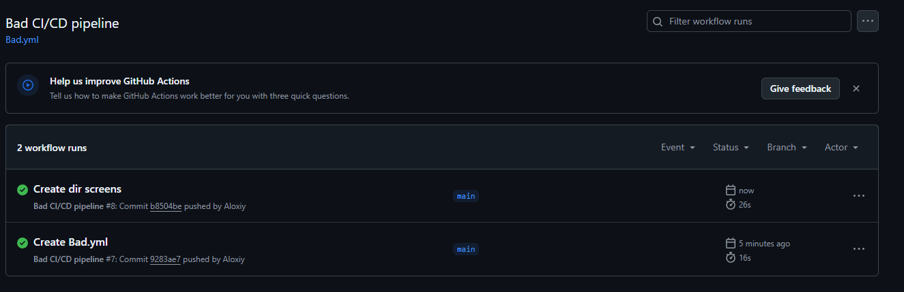
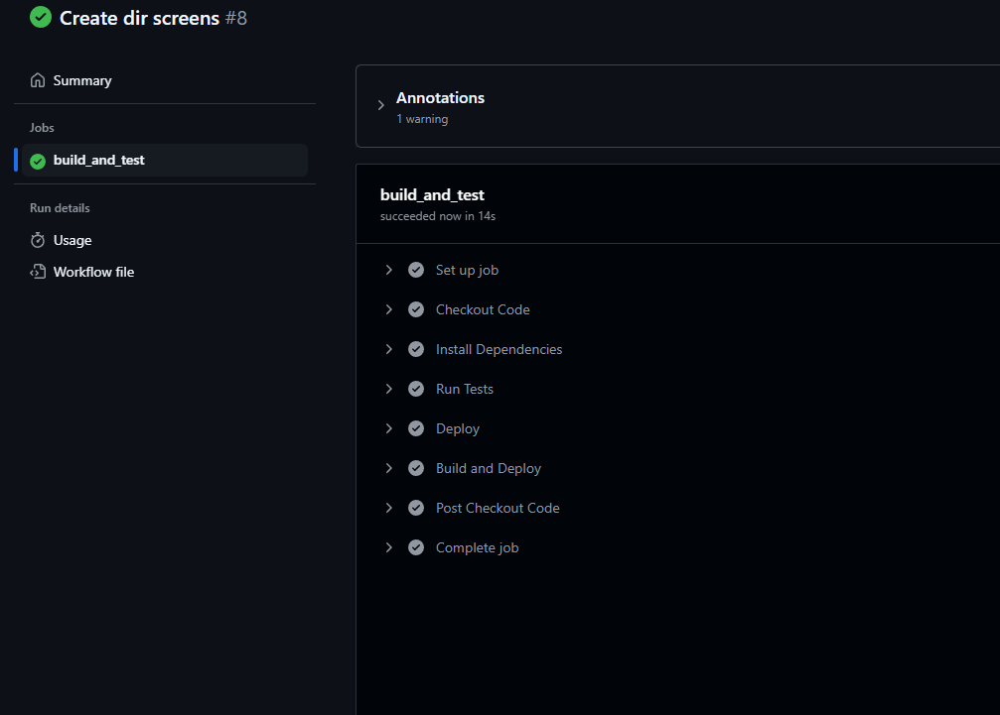
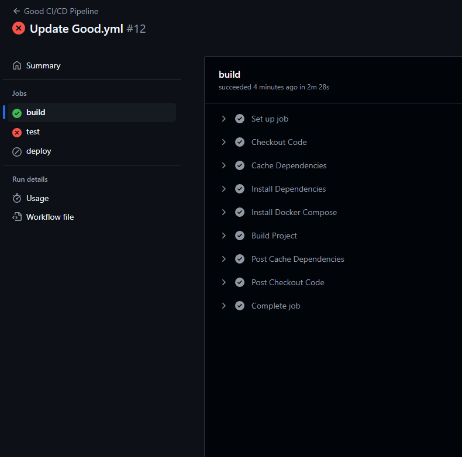

# Лабораторная №3 по DevOps

Выполнили:

**Орлова Алёна (К3223)**

**Феофанов Никита (К3222)**

**Зубов Алексей (К3220)**

# Задание

1. Написать “плохой” CI/CD файл, который работает, но в нем есть не менее пяти “bad practices” по написанию CI/CD
2. Написать “хороший” CI/CD, в котором эти плохие практики исправлены
3. В Readme описать каждую из плохих практик в плохом файле, почему она плохая и как в хорошем она была исправлена, как исправление повлияло на результат
4. Прочитать историю про Васю (она быстрая, забавная и того стоит): https://habr.com/ru/articles/689234/

# Что вообще такое CI- и CD-файлы?

Для начала перед выполнением лабы захотелось в принципе понять, что это за файлы такие)

Выяснилось, что **CI** или **Continuous Integration** - это концепция непрерывного интегрирования, а такие файлики запускают автоматическое тестирование и интегрируют изменения в код. То есть это штука, которая запускает тесты, чтобы проверить, работает ли код правильно

**CD** или **Continuous Delivery/Deployment** - это уже концепция так называемой непрерывной доставки или развертывания кода, то есть когда уже код справился со всеми назначенными для него тестами выше, он либо направляется на сервер для реализации там, либо автоматически разворачивается на сервере

Файлики с этими концепциями пишутс в формате **YAML**, они называются **пайплайнами**, в них реализуются эти ci и cd инструкции. То есть в лабе нам как раз нужно написать хороший и плохой пайплайн)

# Плохой CI/CD-файл

Мы написали вот такой вот CI/CD файл для GitHub Actions, в котором показали 6 плохих практик:

```
name: Bad CI/CD pipeline

on: push

jobs:
  build_and_test:  #1. объединили тестирование и сборку
    runs-on: ubuntu-latest  # 2. использовали последнюю версию убунту
    steps:
      - name: Checkout Code
        uses: actions/checkout@v3
      - name: Install Dependencies
        run: npm install  # 3. npm install вместо npm ci
      - name: Run Tests
        run: ./run_tests.sh || true  # 4. игнор результата тестов
      - name: Deploy
        run: ssh user@server "deploy_script.sh"  # 5. небезопасный SSH-доступ
      - name: Build and Deploy
        run: docker-compose up -d --build  # 6. отсутствие кэширования сборки
```

### Какие же в нем допущены ошибки?

1) Ну для начала, **объединив тестирование и сборку** мы смешали абсолютно разные проблемы вместе, тем самым усложнили отладку ошибок, которые могут возникнуть на одном из двух этапов. Это бусложняет работу отдельных шагов без влияяния на весь процесс

2) Затем мы решили **использовать последнюю версию убунту**, что тоже плохо, потому что это может привести к появлению неожиданных изменений и проблем совместимости при исполнении пайплайна, развертывании кода и тд

3) Третьей ошибкой стал запуск **npm install**. Лучше его не использовать, так как это может изменять зависимости, которые хранятся в файле package-lock.json, может обновлять их, и еще приводит к несоответствиям между окружениями

4) Также в плохом файле **игнорируются результаты тестирования**, что бессмысленно, ведь тестирование для того и нужно, чтобы перехватить ошибки на определенном этапе

5) Далее мы подключаемся к серверу через SSH без использования ключей иили иных методов безопасности, то есть используем **небезопасный ссш-доступ**, тем самым мы напрямую подвергаем систему рискам

6) И последняя ошибка - **отсутствие кэширования**, это замедляет работу файла, потому что каждый раз скачиваются по новой все необходимые пакеты или библиотеки

# Хороший CI/CD-файл

```
name: Good CI/CD Pipeline

on: push

jobs:
  build:
    runs-on: ubuntu-20.04  # 1. фиксированная версия убунту
    steps:
      - name: Checkout Code
        uses: actions/checkout@v3

      - name: Install Docker Compose  # Устанавливаем Docker Compose
        run: |
          sudo apt-get update
          sudo apt-get install -y docker-compose

      - name: Build Project  # Сборка проекта в Docker
        run: docker-compose build

  test:
    runs-on: ubuntu-20.04
    needs: build  # 4. отделили тестирование от сборки
    steps:
      - name: Checkout Code
        uses: actions/checkout@v3

      - name: Run Tests  # Запуск тестов внутри Docker-контейнера
        run: docker-compose run --rm app ./run_tests.sh
        continue-on-error: false

  deploy:
    runs-on: ubuntu-20.04
    needs: test
    steps:
      - name: Install Docker Compose  # Устанавливаем Docker Compose на сервере
        run: |
          sudo apt-get update
          sudo apt-get install -y docker-compose

      - name: Deploy to Server
        run: ssh -i ~/.ssh/deploy_key user@server "docker-compose pull && docker-compose up -d"

```

### Как исправили?

1) Разделили сборку и тестирование на два отдельных этапа, тем самам упростили понимание того, на каком этапе произошла ошибка

2) Стали использовать определенную версию дистрибутива - ubuntu-20.04, теперь она не изменится не по нашему желанию

3) Заменили npm istall на npm ci. Это дает нам подтверждение того, что теперь зависимости будут установлены четко соответствуя package-lock.json, обеспечивая согласованность между окружениями

4) Результаты тестов больше не игнорируются, ошибки не съедаются, поэтому мы можем сразу понять, где какая проблема образовалась и прям на месте ее устранить, чтобы дать пользователю продукт, работающий правильно

5) Установили правильный ссш-досту - сделали ключевую авторизацию, которая не создает рисков для сервера

6) Наконец, стали использовать кэширование с помощью actions/cache, тем самым сократилит время сборки

# Скриншоты

Для того чтобы сделать скриншоты были созданы файлы Bad.yml и Good.yml в директории ".githubs/workflows". Но их текст в некоторых местах отличается от написаного в этом README файле, потому что не все условия выполнялись и некоторые проверки были провальны. Поэтому в некоторых местах написано 'run: echo "Skipping deploy step for now"', таким образом удалось посмотреть что все првоерки файла Bad.yml возможно пройти. Для файла Good.yml, был поменят только блок build, чтобы хотя бы он прошел все проверки, остальные блоки поменяты не были. Чтобы более подробно посмотреть на это, можно напрямую посмотреть pipelines.








# После прочтения история про васю ( :) )


